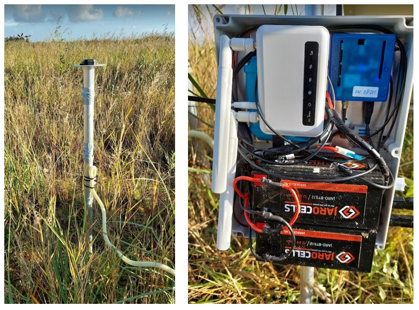

# UbxLogger

U-blox ZED-F9P GNSS logging scripts for OpenWrt and Single Board Computers.

## What is UbxLogger?

`UbxLogger` is a suite of shell scripts and executables for logging data from a U-blox 
ZED-F9P low cost GNSS receiver on OpenWrt routers and Single Board Computers such as the
Raspberry Pi. 

<figure>
   
   <figcaption><em>Example UbxLogger installation for monitoring subsidence and uplift in a 
      peat area, with on the left the GNSS antenna and on the right the internals of the cabinet 
      with U-blox ZED-F9P, GL-iNet OpenWrt router, solar charge controler and LiPo4 batteries.
    </em></figcaption>
</figure>

\
Some of the things you can do with `UbxLogger` are

- Log data from one or more U-blox ZED-F9P receivers to a micro SD card, USB stick and/or 
  disk partition
- Compress the data and save to an archive directory
- Optionally push the compressed data to a remote server over the Internet (requires LAN, WAN or 4-G connectivity)
- Optionally convert the data to RINEX version 3 files, at a selectable sample rate and interval,
  compress using Hatanaka compression and gzip, archive and/or push to a remote server.
- Start on (re)boot, monitoring and restart 

You have have the choice to create compressed RINEX files on OpenWrt (or SBC) and push the RINEX to
the remote server, and/or push ubx rawdata files to the remote server and convert to RINEX on
the remote server. To transfer the compressed RINEX files, especially at a lower sample rate, requires 
only a fraction of the bandwith compared to ubx. 

## How to use UbxLogger

`UbxLogger` is designed to run on power efficient OpenWrt routers and Single Board Computers and
is written entirely in shell script with a few pre-compiled c executables . It is known
to work with

- The GL-iNet X750V2 (Spitz) OpenWrt 4G router
- Raspberry Pi single board computer and Teltonika RUT240 4G router

The total power consumption on the GL-iNet Spitz is below 3W, making this an ideal platform 
for solar powered operation.

Instructions on using the software, hardware recommendations, and installation instructions are
given in the `docs/` folder.

Scripts, executables and modified source code are available as releases on this Github repository. 

To install the UbxLogger software download the installation script, run and follow the instructions

> curl -L https://github.com/hvandermarel/ubxlogger/raw/refs/heads/main/sys/ubxlogger_install_part1.sh -o install.sh \
> ./install.sh

For more information on the installation and configuring the software see the manuals.

## Copyright and licence

Copyright 2024 Hans van der Marel, Delft University of Technology.

Licensed under the Apache License, Version 2.0 (the "License");
you may not use this software except in compliance with the License.
You may obtain a copy of the License at

> http://www.apache.org/licenses/LICENSE-2.0

Unless required by applicable law or agreed to in writing, software
distributed under the License is distributed on an "AS IS" BASIS,
WITHOUT WARRANTIES OR CONDITIONS OF ANY KIND, either express or implied.
See the License for the specific language governing permissions and
limitations under the License.

The current release is at `v1.0`.

## Further reading

[1]. H. van der Marel (2024), UbxLogger Software Manual, TU Delft, September 2024.\
[2]. H. van der Marel (2024), UbxLogger Hardware Manual, TU Delft, September 2024.\
[3]. H. van der Marel (2024), UbxLogger GL-iNet Installation Guide, TU Delft, September 2024.

[1]: <docs/UbxLogger_Software_Manual.md> "H. van der Marel (2024), UbxLogger Software Manual, TU Delft, September 2024."
[2]: <docs/UbxLogger_Hardware_Manual.md> "H. van der Marel (2024), UbxLogger Hardware Manual, TU Delft, September 2024."
[3]: <docs/UbxLogger_GL-iNet_Installation_Guide.md> "H. van der Marel (2024), UbxLogger Gl-iNet Installation Guide, TU Delft, September 2024."

