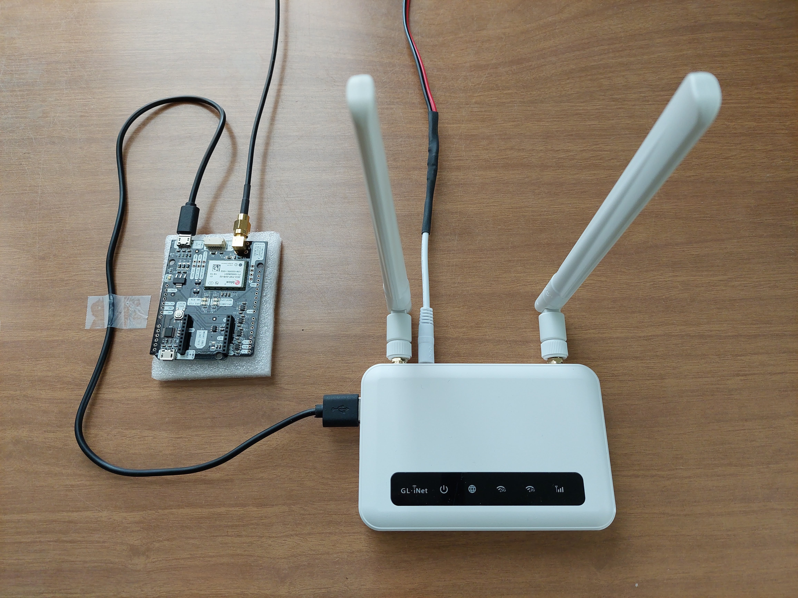
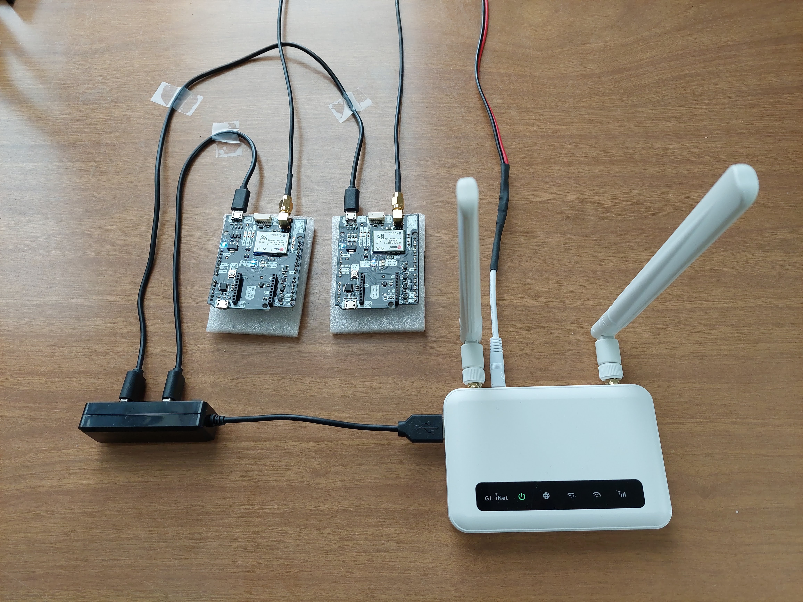
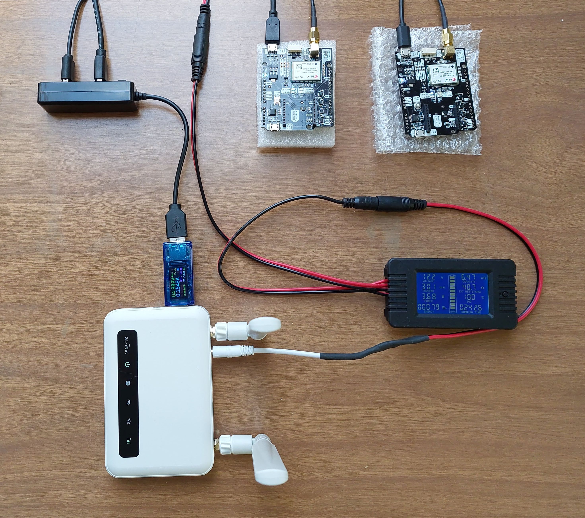

# UbxLogger Hardware Manual

**Hans van der Marel, TU Delft, September, 2024.**

## What is UbxLogger?

`UbxLogger` is a suite of shell scripts and executables for logging data from a U-blox 
ZED-F9P low cost GNSS receiver on OpenWrt routers and Single Board Computers such as the
Raspberry Pi. 

Some of the things you can do with `UbxLogger` are

- Log data from one or more U-blox ZED-F9P receivers to a micro SD card, USB stick or
  disk partition
- Compress the data and save to an archive
- Optionally push the compressed to a remote server over the Internet (requires LAN, WAN or 4-G connectivity)
- Optionally convert the data to RINEX version 3 files, at a selectable sample rate and interval,
  Hatanaka and gzip compress, archive and/or push to a remote server.
- Start on (re)boot, monitoring and restart 

You have have the choice to create compressed RINEX files on OpenWrt or SBC and push the RINEX to
the remote server, and/or push ubx rawdata files to the remote server and convert to RINEX on
the remote server. To transfer the compressed RINEX files, especially at a lower sample rate, requires 
only a fraction of the bandwith compared to ubx. A single receiver can produce up to 4 GB/Month of
compressed raw ubx data if only raw measurements are stored (UBX-RXM-RAWX records). If also navigation 
data is stored (UBX-RXM-RAWX + UBX-RXM-SFRBX records) the number increases to 6 GB/Month. The RINEX data,
at 10 sec sample rate, only takes less than 200 MB/Month.  

`UbxLogger` is designed to run on power efficient OpenWrt routers and Single Board Computers. 
In this document the hardware setup is described for two example configurations

- The GL-iNet X750V2 (Spitz) OpenWrt 4G router
- Raspberry Pi single board computer with Teltonika RUT240 4G router

## GL-iNet X750V2 OpenWrt router

The `GL-X750V2` Spitz is a 3G/4G dual-band wireless router running OpenWRT OS. It has built-in mini PCIe 3G/4G 
module, built-in *128GB MicroSD capacity* and *USB-A* port. Of course, it also has 2GHz/5GHz Wi-Fi, LAN and WAN
ports seen on most other routers. 
Running on OpenWrt you can compile your own firmware and software to fit different application 
scenarios. 

This makes it an ideal controller for GNSS receiver boards, such as the `U-blox ZED-F9P`, which can be
directly connected to and powered by the USB-A port on the router. The `ubxlogger` scripts running on
OpenWrt saves the raw receiver data to the router's MicroSD card, optionally converts it into RINEX and
optionally send it to an upstream server using the 4G connection. 

<figure>
    
    <figcaption>GL-iNet basic GNSS logger with a single U-blox ZED-F9P.</figcaption>
</figure>

\
With an additional USB hub the router can log data from more than one receiver. 

<figure>
    
    <figcaption>GL-iNet dual GNSS logger with two U-blox ZED-F9P's.</figcaption>
</figure>

\
The GL-iNet router has three main user interfaces

1. GL-iNet Web Admin Panel (http://192.168.8.1)
2. OpenWrt LuCI web user interface (http://192.168.8.1/cgi-bin/luci)
3. SSH to the router BusyBox ash shell (`ssh root@192.168.8.1`)

The first is a Grafical User Interface (GUI) for standard settings
and firmware upgrades. The second is a GUI for OpenWrt to do more advanced settings. Many
tasks can be done in both GUI's, but not everything. The third is a Command Line Interface (CLI)
which will be used for setting up regular Linux stuff and the `ubxlogger` software.

The GUI's are accessible with a web-browser on the local LAN after connecting to the router with a LAN cable or via WiFi. the WiFi password is `*secret-1*`. The admin/root password is `*secret-2*`. The GUI is also available remotely (over 4G) via the [GoodCloud](https://www.goodcloud.xyz/#/login) Cloud Management Software. The *GoodCloud* password is `*secret-3*`.

The `ubxlogger` software is managed through `ssh`. This can be done on the local LAN using
a `ssh` client (e.g. Putty on Windows) or remotely over 4G using `ssh` from the *GoodCloud* interface.

On the operational system WiFi is turned off to save power. To use WiFi on the local LAN you have first to enable it using a LAN cable or remotely through *GoodCloud*. 

For more information on the GL-iNet Spitz see https://www.gl-inet.com/products/gl-x750/ or 
check out https://openwrt.org/start for working with OpenWrt. See also [2] for the
installation manual.

## Raspberry Pi with Teltonika RUT240 4G router

This setup is now obsolete as the *GL-iNet X750* is our preferred platform because of the
lower power requirements and ease of installation and use. Some description may be added
at a later time for historical reasons. We use the hardware setup with Raspberry Pi also as
a reference benchmark for comparisons.

## UbxLogger software

In this section a short introduction to the `UbxLogger` software is given. The software is described in more detail in the [UbxLogger Software Manual][1].   

The `UbxLogger` software is written entirely as shell scripts. No `Python`, `Perl`, or other
interpreter tools are required. The reason for this is to reduce memory usage and be able to
runs it on `OpenWrt` routers with limited flash, ROM and RAM memory, while simultaneously be 
able to run it on more powerfull single board computers like the Raspberry Pi. 

The scripts have been written with `BusyBox` ash shell in mind. `BusyBox` was specifically 
created for embedded operating systems with very limited resources and is used also by 
`OpenWrt`. The scripts also run on the more powerful `bash` shell used by for instance
the Raspberry Pi and many other Linuxes.

In the background `str2str` from `RTKLIB` is used to capture data from the receiver. This can
be imported as extension package in `OpenWrt`. If not available for your system, it can 
be cross-compiled on a Linux desktop using the `OpenWrt` developer suite and `RTKLIB` source
code. On the Raspberry Pi you can natively compile `str2str` with `gcc` from the `RTKLIB` source
code.

For the conversion to RINEX the `convbin` console app from `RTKLIB` and `rnx2crx` from 
Yuki Hatanaka are needed. These can be compiled natively on the Raspberry Pi, or cross-compiled 
using the  `OpenWrt` developer package. It is also possible to convert the data to RINEX on an 
upstream server, desktop or laptop using the same scripts. 

All data files follow the RINEX3 file naming convention

>    SITExxST#_YYYYDDDHHMM_FFU_DDU_MO.{ubx|rnx|crx}[.gz] 

All elements are fixed length and are separated by an underscore “_” except 
for the file type (`ubx`, `rnx` or `crx`) and optional compression field (`.gz`)
that use a period “.” as a separator. 

The 9 character station name `SITExxST#` consists of a 4-character site name `SITE` (e.g.
'ZEGV', 'ROVN', ...), a fixed separator `xx`, and an instrument sub-identifier `ST#`. 
Note that we cannot use `_` or `-` as separators or in the names, as `_` is reserved for 
separating fields in the RINEX name, nor can we use `-` as this is very
awkward for shell scripting. The `xx` sets it also apart from the IGS naming convention.

The instrument identifier `ST#` can basically be anything as long as it is 3 characters, so 
that the total length of the station name does not exceed 9 characters. A sensible
naming scheme could be the following: two characters `ST` (for stratum) identifying the 
foundation depth followed by a number `#` to indicate the location at a site (to cover 
situations when there are multiple instrument locations at a site). The stratum `ST` can either 
be *TS* an instrument embeded in the top soil, *DF* for a deeply founded instrument, or *SA*, 
*SB*, *SC*, etc., to indicate a specific stratum in the soil layers.  

The software is managed through the `ubxlogd` script. The syntax is

>    ./ubxlogd.sh [start|stop|check|restart|status] 'identifier'\
>    ./ubxlogd.sh status\
>    ./ubxlogd -h

The 9 character station name `SITExxST#` is used for `'identifier'`.  

For more details and other commands see the [UbxLogger Software Manual][1].   

## Typical data storage and transmission

This section is a shortened version from the [UbxLogger Software Manual][1] to provide
an idea of the amount of data that is involved.

### gzip compressed ubx data 

Under normal (full-sky) tracking conditions the typical amount ubx data that is
collected, after compression with gzip, is

|       | RAWX    | RAWX+SFRBX |
| ----- | ------- | ---------- |
| Hour  | 4.2 MB  | 5.7 MB     |
| Day   | 100 MB  | 138 MB     |
| Month | 3.0 GB  | 4.1 GB     |
| Year  | 36 GB   | 49 GB      |

This is the amount of data that needs to be transmitted and stored.

As the navigation data (broadcast data messages send by the satellites) is the same for all stations, and can also be retrieved from the Internet, it is not necessary log `SFRBX` messages.
Therefore, storing only UBX-RXM-RAWX data for a single receiver will fill up a 128 GB micro SD 
card in about 3 years, and requires a 4-5 GB data subscription with your telecom
provider. 

### Hatanaka and gzipped RINEX version 3 files

Hatanaka compressed and gzipped RINEX version3 files tend to be smaller than 
u-blox raw data files. When the sample rate is further reduced to e.g. 10 seconds, the
file sizes are only a fraction of the raw ubx data.

|       | intv   | crx.gz  |
| ----- | ------ | ------- |
| Hour  | 1 sec  |  2 MB   |
| Day   | 10 sec | 4.5 MB  |
| Month | 10 sec | 140 MB  |
| Year  | 10 sec | 1.6 GB  |

Compressed navigation files are typically 300 KB per day.

Storing and transmitting compressed RINEX 3 data at 10 second sample rate takes only 1/20 - 1/30 
of the data volume of raw ubx data.

## Typical power consumption

### Factory specifications

The factory specifications for the different components are

| Device              | Voltage  | Idle     | Typical  | Max Dev  | USB Amp. | Remarks        |
| ------------------- | -------- | -------- | -------- | -------- | -------- | -------------- |
| U-blox ZED-F9P      | 5 V      |          | 600 mW   |          | n/a      | Note 1         |
| ANN-MB-00 antenna   | 3-5 V    |          |  45 mW   |          | n/a      |                |
| 2B Survey antenna   | 3-5.5 V  |          | 150 mW   |          | n/a      |                |
| Raspberry Pi Zero W | 5 V      | 500 mW   | 750 mW   | 850 mW   | <2.5 W   |                |
| Raspberry Pi 3B+    | 5 V      | 1.9 W    | 5.0 W    | 5.1 W    | <6 W     |                |
| Teltonika RUT-240   | 9-30 V   | 1.5 W    | 4.2 W    | <6.5 W   | n/a      | Note 2, 3      |
| GL.iNet X750V2      | 12 V     |          | 4.5 W    | <5.5 W   | <3.5? W  | Note 4, 5, 6   |

Notes:

1. SimpleRTK2B, no radios, from ArduSimple
2. Teltonika RUT240, Idle, is Mobile data on, no trafic, 12 Voltage
3. Teltonika RUT240, Typical, Mobile data on, LAN, WiFi, trafic
4. The GL.iNet X750V2 uses an uncommon barrel power connector outside/inside 4.0/1.7. 
5. From the GL.iNet forum, for older model GL-X750, system idle with 2.4Ghz Wifi running 
   in STA+AP mode ~1.8W-1.9W (~150-160mA@12V), add 5.2Ghz AP brings it up to ~ 2.2 W (~180mA @12V),
   add cellular w/EP06 goes to ~2.3-2.4W(~190-200mA @12V).
6. This number is not available from the GL-iNet specs. The USB 2.0 industry specifies a 
   maximum current draw of 500 mA (2.5 W). On the GL-iNet forum there is one report that someone
   succesfully connect a USB modem (to an other device, not Spitz) with a power draw of 3.5 W.

The 6th column, "USB Amp" specifies the maximum possible power draw from the USB-A 2.0 port 
if such a port is available on the device. If a USB 2.0 port is not available on the SBC or
router, the receiver must be powered using an external device.

### Measured power consumption

#### Measurement setup

Voltage and current are measured separately in the 12 V and 5 V circuits. For the 12 V circuit 
a *DEWIN PZEM-013 DC 0-200 V 10A* Digital Battery Tester, Power and Energy
meter is used. For the 5 V circuit a USB 3.0 *AT35 3.7-30V 0-4A* digital Multimeter is used.
Both instruments measure instantaneous Voltage (V), Amperes (A) and Power (W) and the consumed energy (Wh) over time. 

<figure>
    
    <figcaption>Power test measurement setup with GL-iNet dual GNSS logger with two U-blox ZED-F9P's.</figcaption>
</figure>

#### GL-iNet X750V with two ZED-F9P receivers

Current and voltage is measured at two points

1. The 12 V barrel connector of the GL.iNET X750V2, which gives the total power consumption
2. The USB-A port of the GL-iNET between the GL-iNet and USB hub, which gives the power 
   consumption of **two**  U-blox ZED-F9P, two ANN-MB-00 antennas, and one USB-hub.

The second measurement (two U-blox ZED-F9P, two ANN-MB-00 antennas, and one USB-hub) is very stable

>    0.29 A @ 5 V  ->  1.5 W for **two** receivers

Thus, the power consumption for a single receiver, with ANN-MB-00 antenna, is 750 mW, which is a bit more
than what is given in the specs (645 mW). 

The power consumption of two ZED-F9P receivers is also well below the limit USB-A 2.0 port can provide, 
so there is no need for external power supply. 

The total power consumption is more variable. It is given in the table below for various scenarios

| Scenario          | Current@Voltage | Power        | Remarks                     |
| ----------------- | --------------- | ------------ | --------------------------- |
| Full load         | 360mA@12V       | 4.4 W        | Copying a tar file via WiFI |
| Logging 2+5G WiFi | 320mA@12V       | 4.0 W        |                             |
| Logging 2G WiFi   | 280-300mA@12V   | 3.4-3.7 W    |                             |
| Logging no WiFi   | 250-280mA@12V   | 3.0-3.4 W    |                             |

The LAN cable was not connected. Also no clients connected to WiFi during the 
measurement. Turning WiFi off has a big impact. If necessary, it can be turned on
again using the remote connection over the 4G network.

The 4G network was connected during all measurements, but without much trafic (No
file transfers).

During a file transfer the power consumption peaks to 5.3W for very brief moments (with WiFi
turned off). Also, during file compression with gzip, it seems there is a very small increase 
in power consumption (maybe 0.2 W), but hardly measurable because of the fluctuations.

To get a good impression on the average power consumption the power consumption was measured 
over a **24 hour** period, with two receivers, and with WiFi turned off. The measured power
consumption over a full day 
is **78.2 Wh**, or **6.41 Ah** @ 12.2 V, per day. This is equal to **3.25 W** or **270 mA** 
@ 12.2 V.  

To summarize, with WiFi off, the total power consumption is well below 3.5 W . 

#### GL-iNet X750V with one ZED-F9P receiver

If only one receiver, and no hub, is used the total power consumption is expected 
to be less than 2.7 W.

#### Raspberry Pi 3B+, Teltonika RUT240 Router, and one or two receivers 

No measurements available yet.

## Solar power and battery dimensioning

The input parameters for the solar power and battery dimensioning are

>    SystemPower = 3.5 W \
>    EquivalentSunHours = 1.08 hours\
>    PowerRatio = 1.5

The equivalent Sun hours are for London, in December, south facing panels angled at 50°.
The power ratio is to account for losses in the panels and charge controler.  

The consumed power per day is

>    PowerConsumed = SystemPower * 24 hours = 3.5 W * 24 = 84 Wh per day

The minimal required panel power is then

>   PanelPower = PowerConsumed * PowerRatio / EquivalentSunHours  = 84 * 1.5 / 1.08 = 117 Wp

Batteries are sized based on the number of days to run the device with Sunshine. The number of
days the device can run on batteries alone is calculated As

>    NumberOfDays = BatteryCapacityAh * 12 * 0.9 / PowerConsumed

Here BatteryCapacityAh is given in Ah, the factor 12 is to convert Ah into Wh. The factor 0.9 is
to account for the minimal discharce percentage of 10% for a battery. 

For a 84 Wh power consumption per day, the number of days for two common battery capacities
is

| Battery Capacity | No Sunshine    |
| ---------------- | -------------- |
| 30 Ah            | 3.85 days      |
| 50 Ah            | 6.4 days       |

Batteries should be sized to run the device for at least 4 days. 

In order to be able to operate throughout the Month of December, we require at least (**To be confirmed**)

- 120 Wp Solar panels
- 50 Ah Lithium battery

Though a more practical sizing may be 60 Wp Solar Panels with a 30 Ah LiPo4 battery with a small amount of down-time in December.

## Parts list

### UbxLogger hardware

| Part                      | Qnt | Price       | Supplier                       | Remarks |
| ------------------------- | --- | ----------- | ------------------------------ | ------- |
| SimpleRTK2B ZED-F9P       | 1-2 | &euro; 172  | ArduSimple                     |         |
| u-blox ANN-MB-00 antenna  | 1-2 | &euro; 54   | ArduSimple                     |         |
| USB-A to micro USB cable  | 1-2 | &euro; 3-8  | Alle kabels / Amazon           | 1       |
| 4 port USB hub            |  1  | &euro; 5-17 | Alle kabels / Kiwi / Amazon    | 1       |
| GL-iNet X750V2 EP06       |  1  | &euro; 153  | Amazon                         |         |
| SanDisk 128 GB HiEndu uSD |  1  | &euro; 16   | Amazon                         |         |
| 4G SIM card subscription  |  1  | p/m         | Telecom provider               |         |
| 12 V 5,5x2,1 male cable   |  1  | &euro; 2    | Amazon                         | 2       |
| 12 V 5,5x2,1 female cable |  1  | &euro; 2    | Amazon                         | 2       |

Note 1: USB cables and hubs are widely available but their quality can vary. For good communication
between the receiver and router we advise to invest in good quality cables and hubs. Some recommendations are given in [2].\
Note 2: The GL-iNet comes with its own DC connector and power supply. We recommend cutting the
cable and inserting a male/female 5,5x2,1 12 V DC connectors to ready the equipment for 
battery and solar power.

The total cost for a setup with a single U-blox ZED-F9P receiver is about &euro; 400. A setup
with two U-blox ZED-F9P receivers will cost about  &euro; 600.

The monthly 4G subscription rate varies between &euro; 10 and &euro; 20 depending on the
provider and data volume.  

### USB Hubs

Four different USB hubs have been evaluated

| USB Hub                         | Price        | Supplier          | Remarks              |
| ------------------------------- | ------------ | ----------------- | -------------------- |
| USB Mini Hub w/ Switch          | &euro; 4.95  | Kiwi electronics  |                      |
| KiWiBiRD USB 2-port spliter/hub | &euro; 6.99  | Amazon            | 18Month warrenty     |
| Digitus USB2.0 Hub 4-port       | &euro; 7.39  | Alle kabels       |                      |
| Nedis USB2.0 Hub 4-port         | &euro; 16.49 | Alle kabels       |                      |

The first USB hub, the USB Mini Hub with power switch from Kiwi electronics, was used for
the two week testing period and initial experimentation. During initial experimentation,
sometimes the data connection was lost - the USB contact don't feel very sturdy and are
easy to move in the sockets - but not the 5 V power, resulting in the assignment of a new
device name `/dev/ttyACM#`. This device was subsequently detected by the `crontab` hourly 
`ubxlogd check` and logging to a new file started. During the 2 week test, the USB hub and 
cables were left untouched and no interruptions occured. Our experiences with the first hub 
prompted us to do a evaluation of alternative hubs and alternative USB cables to compare quality. 

### Solar power and batteries

| Part                      | Qnt | Price       | Supplier                       | Remarks |
| ------------------------- | --- | ----------- | ------------------------------ | ------- |
| 120 Wp solar panel        |  1  | &euro; 90   | Eco-Worthy / Amazon            |         |
| 12V 50Ah LifePo4 battery  |  1  | &euro; 160  | Eco-Worthy / Amazon            |         |
| Solar charge controler    |  1  | &euro; 65   | Victron / Amazon               |         |
| Solar cable               |  1  |             |                                |         |
| Battery cable             |  1  |             |                                |         |

The total cost for solar panels and LifePo4 batteries is about &euro; 320, but prices may
vary depending on the chosen components. The quoted prices in the table are amongst
the cheapest.

### Installation

| Part                      | Qnt | Price       | Supplier                       | Remarks |
| ------------------------- | --- | ----------- | ------------------------------ | ------- |
| Antenna monument          |  1  |             |                                |         |
| Instrument cabinet        |  1  |             |                                |         |
| Solar panel mount         |  1  |             |                                |         |

## Further reading

[1]. H. van der Marel (2024), UbxLogger Software Manual, TU Delft, September 2024.\
[2]. H. van der Marel (2024), UbxLogger GL-iNet Installation Guide, TU Delft, September 2024.

[1]: <UbxLogger_Software_Manual.md> "H. van der Marel (2024), UbxLogger Software Manual, TU Delft, September 2024."
[2]: <UbxLogger_GL-iNet_Installation_Guide.md> "H. van der Marel (2024), UbxLogger Gl-iNet Installation Guide, TU Delft, September 2024."

